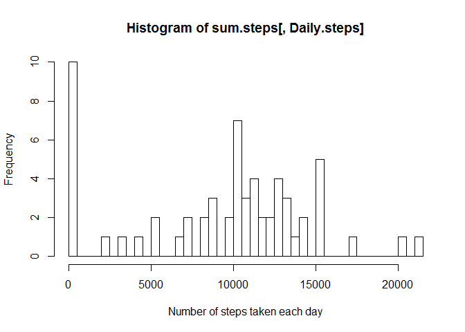
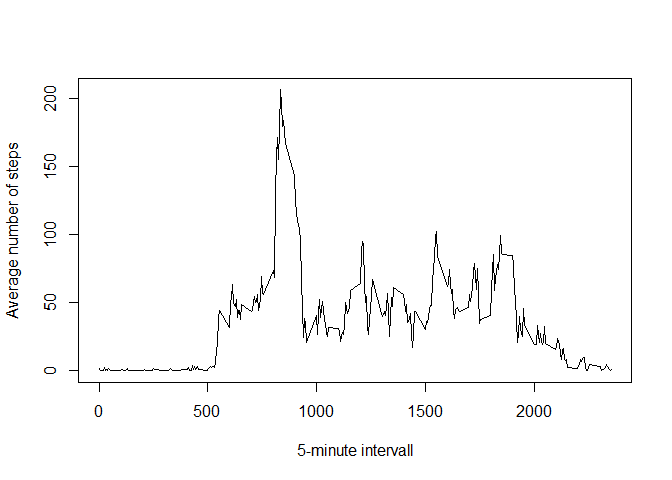
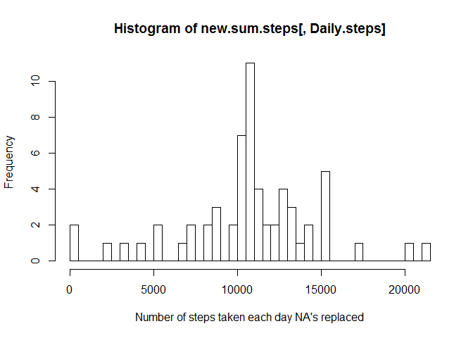
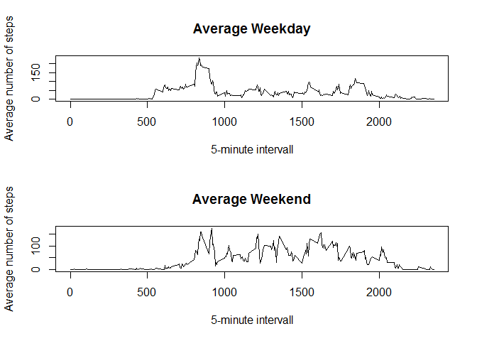

# Reproducible Research: Peer Assessment 1


## Loading and preprocessing the data


## What is mean total number of steps taken per day?


```r
library(ggplot2)
sum.steps <- data[, sum(steps, na.rm = TRUE), by=date]
setnames(sum.steps, "V1", "Daily.steps")
hist(sum.steps[,Daily.steps], breaks = 50, xlab="Number of steps taken each day")
```

<!-- -->

```r
mean(sum.steps[,Daily.steps], na.rm=TRUE)
```

```
## [1] 9354.23
```

```r
median(sum.steps[,Daily.steps], na.rm=TRUE)
```

```
## [1] 10395
```


## What is the average daily activity pattern?


```r
avg.steps.interval  <- data[, mean(steps, na.rm=TRUE), by=interval]
setnames(avg.steps.interval, "V1", "Interval.steps")
plot(avg.steps.interval[,interval] , avg.steps.interval[,Interval.steps], type='l', ylab="Average number of steps", xlab = "5-minute intervall" )
```

<!-- -->

```r
avg.steps.interval[max(Interval.steps),interval]
```

```
## [1] 1705
```


## Imputing missing values

Total number of NA's in the dataset


```r
nrow(data[is.na(steps),])
```

```
## [1] 2304
```

Replace the NA's with the average number of steps in that 5-minute intervall over all days. 


```r
new.data <- merge(data, avg.steps.interval, by="interval", all.x=TRUE) 
new.data[,steps:=as.numeric(steps)]
```

```
##        interval steps       date Interval.steps
##     1:        0    NA 2012-10-01       1.716981
##     2:        0     0 2012-10-02       1.716981
##     3:        0     0 2012-10-03       1.716981
##     4:        0    47 2012-10-04       1.716981
##     5:        0     0 2012-10-05       1.716981
##    ---                                         
## 17564:     2355     0 2012-11-26       1.075472
## 17565:     2355     0 2012-11-27       1.075472
## 17566:     2355     0 2012-11-28       1.075472
## 17567:     2355     0 2012-11-29       1.075472
## 17568:     2355    NA 2012-11-30       1.075472
```

```r
new.data[is.na(steps), steps := Interval.steps]
```

```
##        interval     steps       date Interval.steps
##     1:        0  1.716981 2012-10-01       1.716981
##     2:        0  0.000000 2012-10-02       1.716981
##     3:        0  0.000000 2012-10-03       1.716981
##     4:        0 47.000000 2012-10-04       1.716981
##     5:        0  0.000000 2012-10-05       1.716981
##    ---                                             
## 17564:     2355  0.000000 2012-11-26       1.075472
## 17565:     2355  0.000000 2012-11-27       1.075472
## 17566:     2355  0.000000 2012-11-28       1.075472
## 17567:     2355  0.000000 2012-11-29       1.075472
## 17568:     2355  1.075472 2012-11-30       1.075472
```

```r
new.data[,Interval.steps:=NULL]
```

```
##        interval     steps       date
##     1:        0  1.716981 2012-10-01
##     2:        0  0.000000 2012-10-02
##     3:        0  0.000000 2012-10-03
##     4:        0 47.000000 2012-10-04
##     5:        0  0.000000 2012-10-05
##    ---                              
## 17564:     2355  0.000000 2012-11-26
## 17565:     2355  0.000000 2012-11-27
## 17566:     2355  0.000000 2012-11-28
## 17567:     2355  0.000000 2012-11-29
## 17568:     2355  1.075472 2012-11-30
```
Histogram, mean and median with data with NA's replaced 


```r
new.sum.steps <- new.data[, sum(steps, na.rm = TRUE), by=date]
setnames(new.sum.steps, "V1", "Daily.steps")
hist(new.sum.steps[,Daily.steps], breaks = 50, xlab="Number of steps taken each day NA's replaced")
```

<!-- -->

```r
mean(new.sum.steps[,Daily.steps], na.rm=TRUE)
```

```
## [1] 10766.19
```

```r
median(new.sum.steps[,Daily.steps], na.rm=TRUE)
```

```
## [1] 10766.19
```

After replacing the NA values with mean number of steps in a 5-minute interval the mean and median increase.

## Are there differences in activity patterns between weekdays and weekends?

Adding two factos to the data. One factor indicating if the day is a weekday and one idicating a weekend.


```r
data[, day := weekdays(as.Date(date))]
```

```
##        steps       date interval    day
##     1:    NA 2012-10-01        0 Monday
##     2:    NA 2012-10-01        5 Monday
##     3:    NA 2012-10-01       10 Monday
##     4:    NA 2012-10-01       15 Monday
##     5:    NA 2012-10-01       20 Monday
##    ---                                 
## 17564:    NA 2012-11-30     2335 Friday
## 17565:    NA 2012-11-30     2340 Friday
## 17566:    NA 2012-11-30     2345 Friday
## 17567:    NA 2012-11-30     2350 Friday
## 17568:    NA 2012-11-30     2355 Friday
```

```r
data[, weekday := (day=="Monday"|day=="Tuesday"|day=="Wednesday"|day=="Thursday"|day=="Friday")*1]
```

```
##        steps       date interval    day weekday
##     1:    NA 2012-10-01        0 Monday       1
##     2:    NA 2012-10-01        5 Monday       1
##     3:    NA 2012-10-01       10 Monday       1
##     4:    NA 2012-10-01       15 Monday       1
##     5:    NA 2012-10-01       20 Monday       1
##    ---                                         
## 17564:    NA 2012-11-30     2335 Friday       1
## 17565:    NA 2012-11-30     2340 Friday       1
## 17566:    NA 2012-11-30     2345 Friday       1
## 17567:    NA 2012-11-30     2350 Friday       1
## 17568:    NA 2012-11-30     2355 Friday       1
```

```r
data[, weekend := (day=="Saturday"|day=="Sunday")*1]
```

```
##        steps       date interval    day weekday weekend
##     1:    NA 2012-10-01        0 Monday       1       0
##     2:    NA 2012-10-01        5 Monday       1       0
##     3:    NA 2012-10-01       10 Monday       1       0
##     4:    NA 2012-10-01       15 Monday       1       0
##     5:    NA 2012-10-01       20 Monday       1       0
##    ---                                                 
## 17564:    NA 2012-11-30     2335 Friday       1       0
## 17565:    NA 2012-11-30     2340 Friday       1       0
## 17566:    NA 2012-11-30     2345 Friday       1       0
## 17567:    NA 2012-11-30     2350 Friday       1       0
## 17568:    NA 2012-11-30     2355 Friday       1       0
```

Panel plot containing a time series plot of the 5-minute interval and the average number of steps taken.


```r
par(mfcol=c(2,1))
avg.steps.interval.weekday  <- data[weekday==1, mean(steps, na.rm=TRUE), by=interval]
setnames(avg.steps.interval.weekday, "V1", "Interval.steps")
plot(avg.steps.interval.weekday[,interval] , avg.steps.interval.weekday[,Interval.steps], type='l', ylab="Average number of steps", xlab = "5-minute intervall" , main = "Average Weekday")
avg.steps.interval.weekday[max(Interval.steps),interval]
```

```
## [1] 1925
```

```r
avg.steps.interval.weekend  <- data[weekend==1, mean(steps, na.rm=TRUE), by=interval]
setnames(avg.steps.interval.weekend, "V1", "Interval.steps")
plot(avg.steps.interval.weekend[,interval] , avg.steps.interval.weekend[,Interval.steps], type='l', ylab="Average number of steps", xlab = "5-minute intervall" , main = "Average Weekend")
```

<!-- -->

```r
avg.steps.interval.weekend[max(Interval.steps),interval]
```

```
## [1] 1430
```
